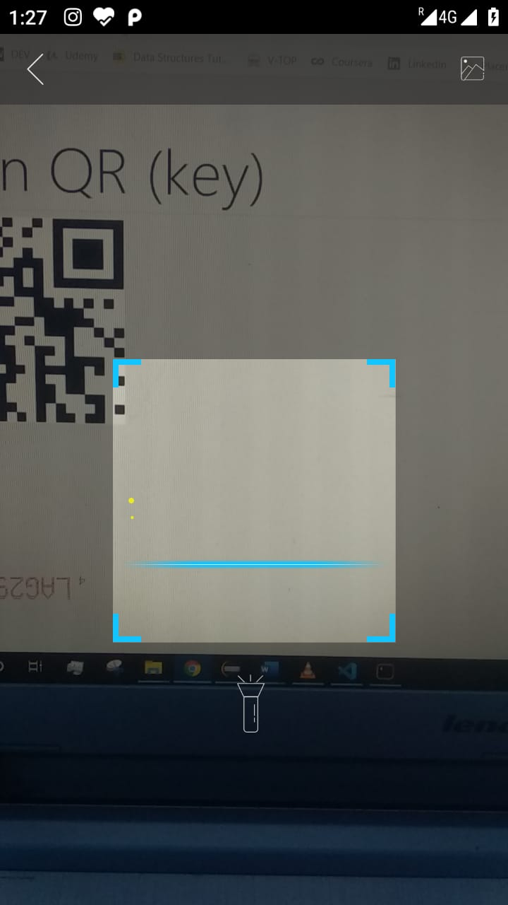
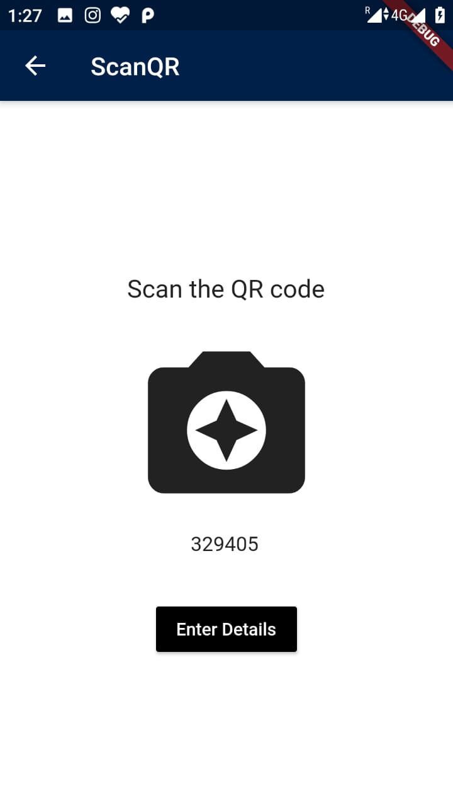
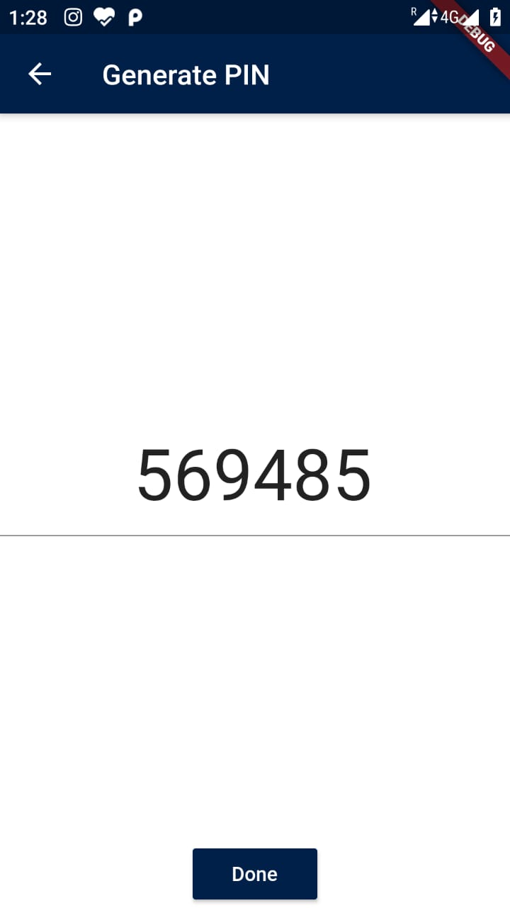
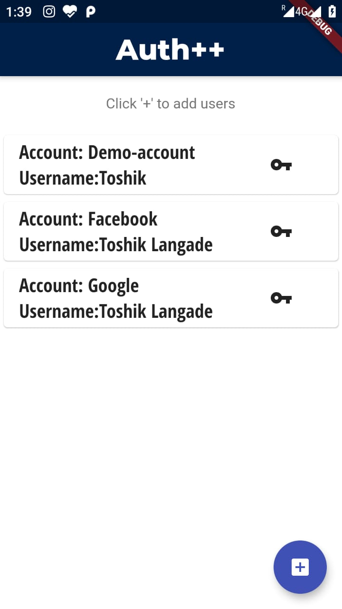

## Two Factor Authentication using RFC 6238 Time-Based OTP Algorithm

* Implemented the RFC6238 algorithm on both web server and mobile application.
* Used ExpressJS,NodeJS and MongoDBAtlas for the website and Flutter(Dart) for the mobile app which can work on both Android and iOS

Web App Repo: https://github.com/ltosh9802/TOTP-Based-Two-Factor-Authentication-Web

## Snapshots of Mobile App

